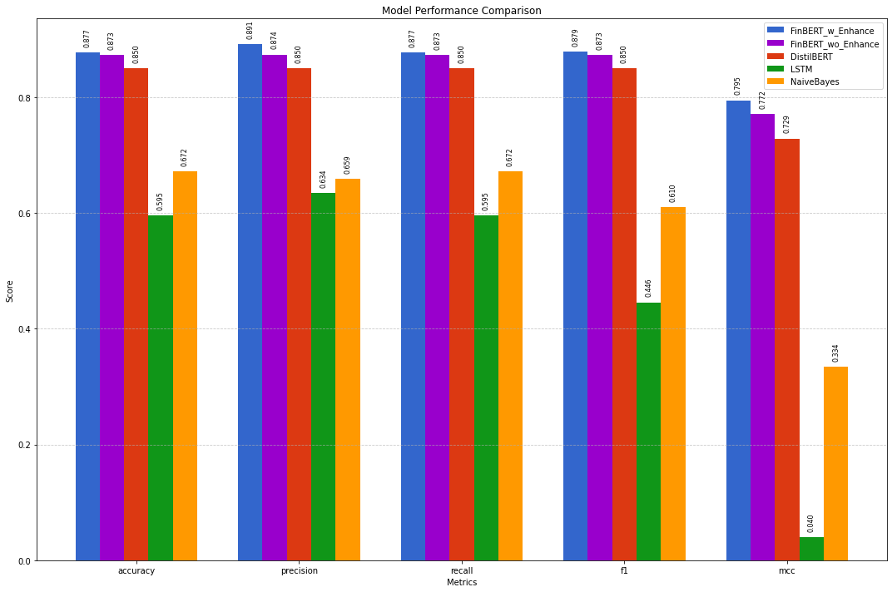
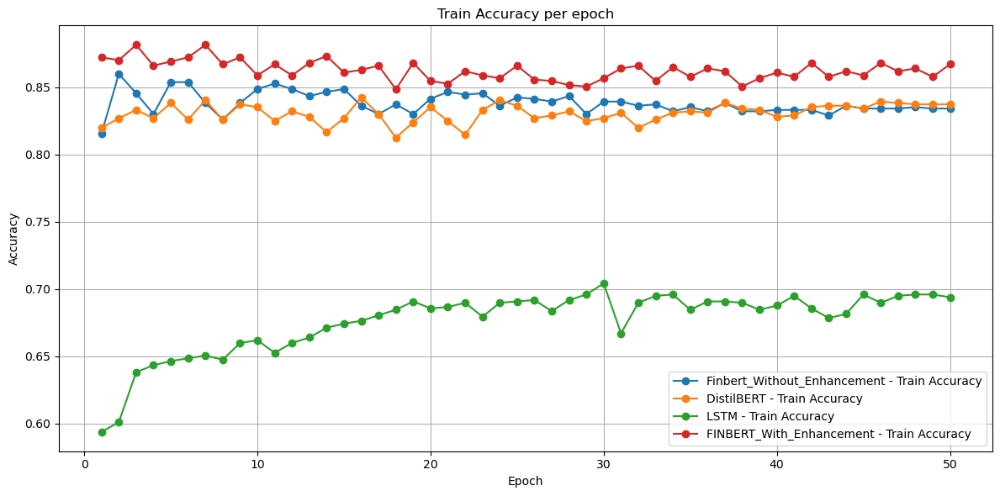
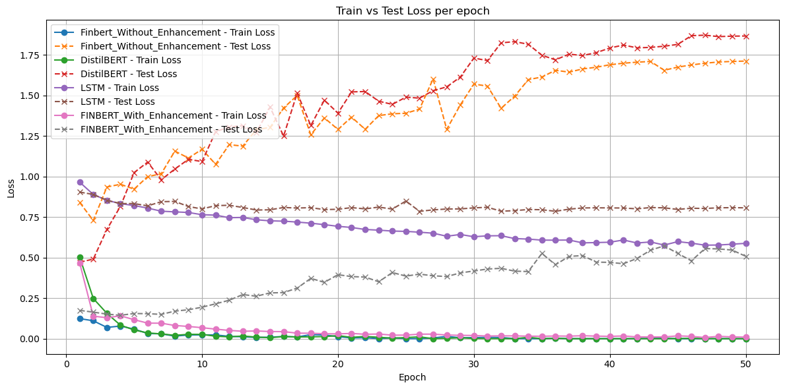
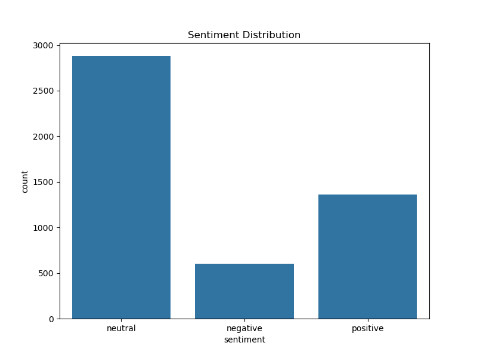

# Financial Sentiment Analysis using FinBERT

[](https://www.python.org/downloads/)
[](LICENSE)
[](https://huggingface.co/ProsusAI/finbert)
[](https://arxiv.org/abs/1908.10063)

Domain-adapted transformer model (FinBERT) for **financial sentiment classification** — outperforming baselines on the Financial PhraseBank dataset through advanced fine-tuning techniques.

## 👨‍🎓 Authors

### Rajeet Chaudhary
- MS Computer Science, Wichita State University
- Backend & ML Engineer
- GitHub: [rajeet10](https://github.com/rajeet10)
- LinkedIn: [rajeet-10](https://linkedin.com/in/rajeet-10)

### Arun Rimal
- MS Data Science, Wichita State University
- Wichita State University

**Paper**: [Financial Sentiment Analysis using FinBERT Model (PDF)](FinancialSentimentAnalysis_FINBERT_IEEE.pdf)

## 🔥 Key Highlights

- Fine-tuned **FinBERT** with **focal loss**, **gradual unfreezing**, **discriminative learning rates** and increased dropout
- Handled severe class imbalance in financial text
- Achieved **state-of-the-art results** among compared models:
  - Accuracy: **86.48%**
  - F1-Score: **86.57%**
  - MCC: **0.7606**
- Comprehensive comparison vs. DistilBERT, LSTM, Naive Bayes

## Table of Contents

- [Overview](#overview)
- [Results at a Glance](#results-at-a-glance)
- [Dataset](#dataset)
- [Models Compared](#models-compared)
- [Training Enhancements](#training-enhancements)
- [Installation & Usage](#installation--usage)
- [Repository Structure](#repository-structure)
- [License](#license)
- [Acknowledgments](#acknowledgments)
- [Contact](#contact)

## Overview

Financial sentiment from news, reports, earnings calls, and social media strongly influences markets and investment decisions. This project demonstrates how **domain-specific pre-training + targeted fine-tuning** significantly outperforms general-purpose and traditional models in **positive / neutral / negative** classification of financial text.

Full methodology, experiments, and analysis are detailed in the accompanying research paper.

## Results at a Glance

| Model                  | Accuracy | F1-Score | MCC     | Parameters | Notes                              |
|------------------------|----------|----------|---------|------------|------------------------------------|
| **FinBERT (Enhanced)** | **86.48%** | **86.57%** | **0.7606** | ~110M     | Focal loss + gradual unfreezing   |
| FinBERT (Baseline)     | 85.55%   | 85.56%   | 0.7375  | ~110M     | Standard fine-tuning              |
| DistilBERT             | 83.38%   | 83.34%   | 0.6985  | ~67M      | Lightweight transformer           |
| LSTM                   | 70.38%   | 69.18%   | 0.4361  | ~3.3M     | BiLSTM baseline                   |
| Naive Bayes            | 67.18%   | 61.01%   | 0.3337  | —         | TF-IDF + Multinomial NB           |

  
*(Bar chart comparing all five metrics across models)*

Training curves also show better generalization and lower overfitting with the enhanced version:

  



## 📊 Dataset

We use the **Financial PhraseBank** dataset, a widely adopted benchmark for financial sentiment analysis.

### Details
- **Financial PhraseBank** (Malo et al., 2014)
- Total samples: **4,845 sentences**
- Labels: **Positive, Neutral, Negative**
- Source: Financial news statements and reports
- High-quality labels with **100% annotator agreement**
- Suitable for domain-specific sentiment classification
- Labels: positive / neutral / negative
- High-agreement subset used (most reliable annotations)
- Strong class imbalance → neutral dominates


Financial_phrase_bank.csv

```
Each row contains:

| Text | Label |
|------|---------|
| "Company profits increased this quarter" | Positive |
| "Revenue remained unchanged" | Neutral |
| "Net losses widened due to costs" | Negative |

> Note: Dataset is included for research and academic purposes.
```


## Models Compared

| Feature              | FinBERT (Enhanced)          | FinBERT (Baseline) | DistilBERT       | LSTM            | Naive Bayes     |
|----------------------|-----------------------------|--------------------|------------------|-----------------|-----------------|
| Base                 | BERT-base (12 layers)       | BERT-base          | DistilBERT (6L)  | BiLSTM (2L)     | Traditional ML  |
| Embedding            | 30k vocab, 768d             | 30k vocab, 768d    | 30k vocab, 768d  | 100d trainable  | TF-IDF (≤5k)    |
| Dropout              | 0.3 (attention & FF)        | 0.1                | 0.1 / 0.2        | 0.5             | —               |
| Parameters           | ~110M                       | ~110M              | ~67M             | ~3.3M           | —               |
| Key Enhancements     | Focal loss, gradual unfreeze, discriminative LR | —                  | —                | —               | —               |

## Training Enhancements (that made the difference)

- **Focal Loss** (α=1, γ=2) — focuses on hard / minority-class examples
- **Gradual Unfreezing** — classifier → last layers → full model over 4 epochs
- **Discriminative Learning Rates** — 1e-5 (lower layers) → 4e-5/5e-5 (head)
- **Higher Dropout** (0.3 instead of 0.1)
- **AdamW** + linear scheduler with warmup
- Batch size 16, up to 50 epochs, GPU training

## Installation & Usage

```bash
# 1. Clone repo
git clone https://github.com/yourusername/financial-sentiment-analysis-finbert.git
cd financial-sentiment-analysis-finbert

# 2. Install dependencies
pip install torch transformers datasets scikit-learn pandas matplotlib seaborn jupyter
```

Then open:
```Bash
jupyter notebook main_proposal_impl_01.ipynb
```
Run cells sequentially → data loading → training → evaluation → visualizations.

## 📁 Repository Structure

```text
.
├── FinancialSentimentAnalysis_FINBERT_IEEE.pdf   
├── Financial_phrase_bank.csv                 
├── main_proposal_impl_01.ipynb                   
├── images/                     
│   ├── Fig1_Dataset.png
│   ├── Fig2_Sentence_Format.png
│   ├── Fig3_Model_Performance.png
│   ├── Fig4_Training_Accuracy.png
│   └── Fig5_Train_Test_Loss.png
├── LICENSE                                    
└── README.md
```


## 📜 License

This project is licensed under the **MIT License**.

You are free to use, modify, and distribute this software for academic and commercial purposes, provided that the original license and copyright notice are included.


## 🙏 Acknowledgments

- **Dr. Lokesh Das** — Project guidance and mentorship  
- **ProsusAI** — Open-source FinBERT model  
- **Malo et al.** — Financial PhraseBank dataset  

---

## 💬 Contact & Support

Feedback, questions, or collaboration opportunities are welcome.

⭐ If you find this repository useful, please consider giving it a star!
